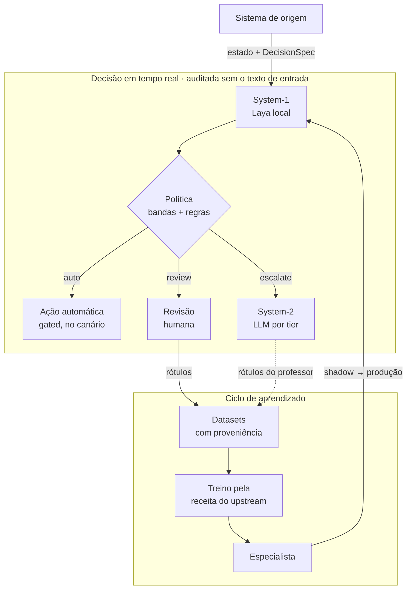
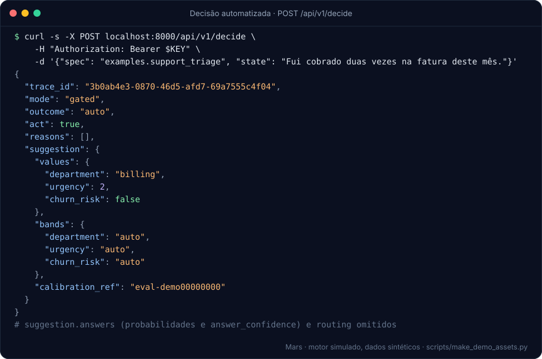
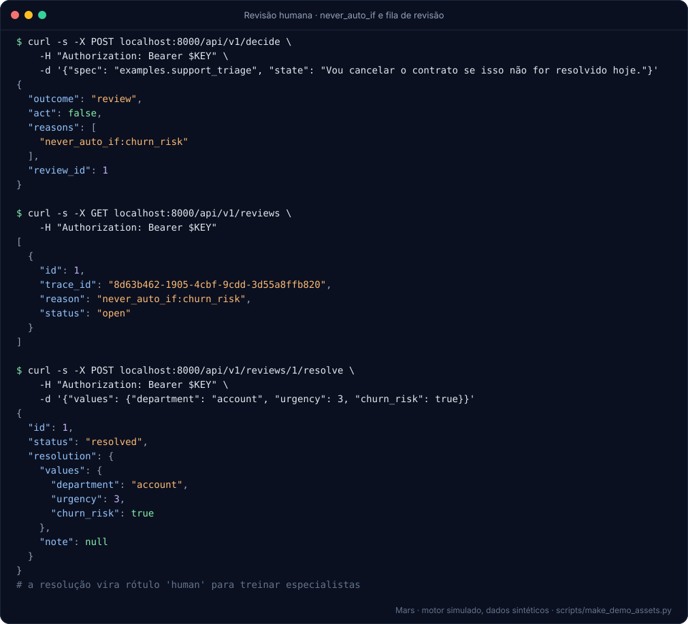
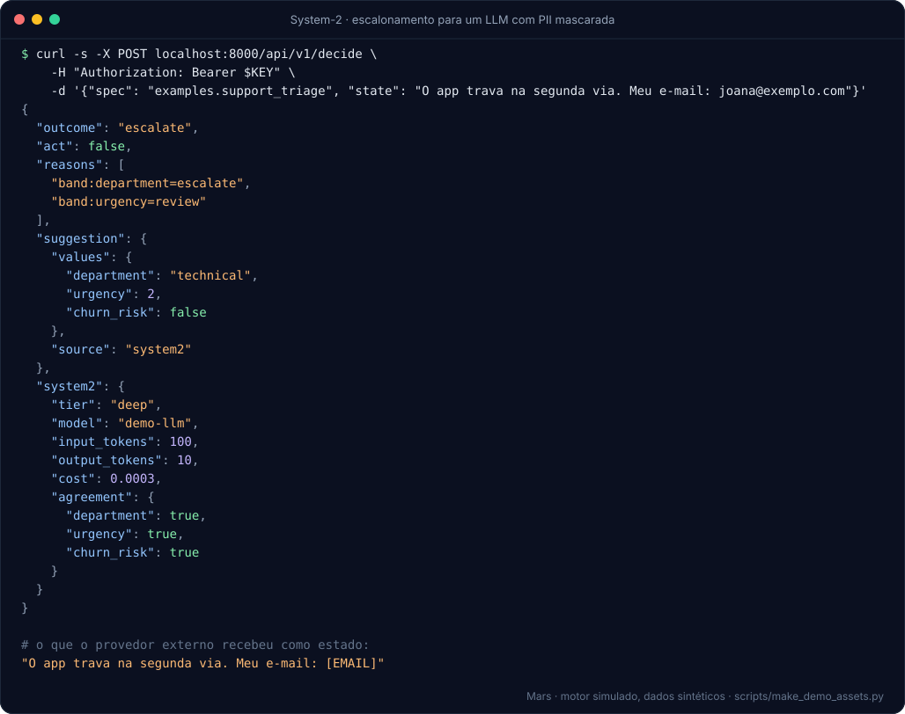
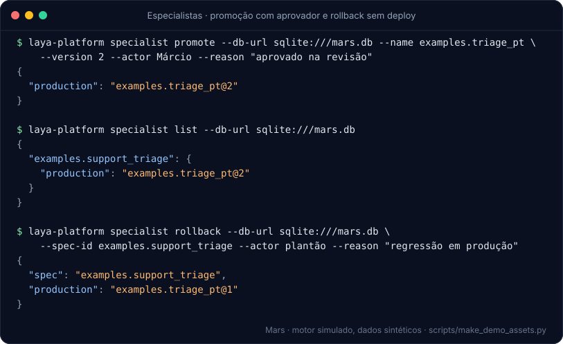
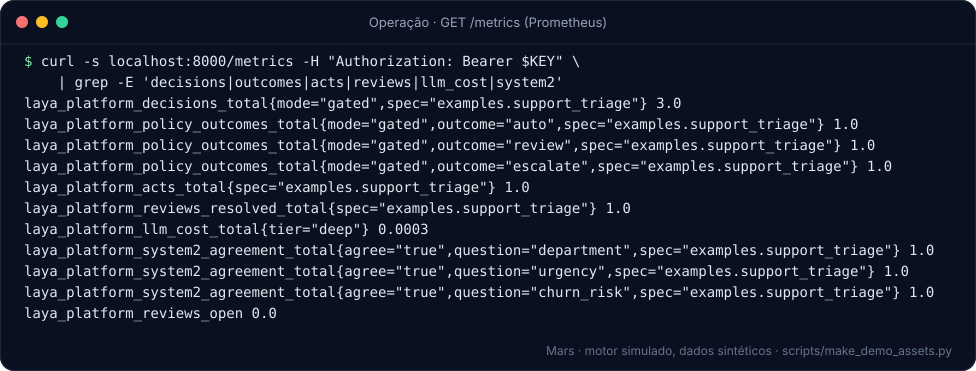
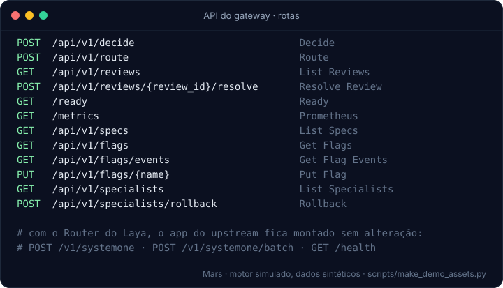

<p align="center">
  
</p>

<p align="center">
  <a href="https://github.com/SaYm0n/Laya/actions/workflows/ci.yml"></a>
  <a href="https://github.com/SaYm0n/Laya/actions/workflows/security.yml"></a>
  
  
  
  <a href="LICENSE"></a>
</p>

<p align="center">
  <a href="#visão-geral">Visão geral</a> ·
  <a href="#como-funciona">Como funciona</a> ·
  <a href="#demonstração">Demonstração</a> ·
  <a href="#fluxos-de-trabalho">Fluxos de trabalho</a> ·
  <a href="#começando">Começando</a> ·
  <a href="docs/README.md">Documentação</a>
</p>

> **Mars** é um projeto independente de Márcio, construído sobre o [Laya](https://github.com/NandhaKishorM/laya)
> (Apache-2.0, Convai Innovations). **Não é afiliado nem endossado** pela Convai Innovations ou pelo projeto Laya.

## Visão geral

Mars é uma plataforma de decisão para quem precisa automatizar **decisões fechadas e repetitivas** (triagem,
classificação, priorização, roteamento) sem perder o controle sobre o que é automatizado.

- **System-1, local e rápido:** o Laya responde perguntas tipadas (`choice`, `score`, `noul`) num único passe, na
  sua infraestrutura, com uma confiança calibrável.
- **Política explícita:** cada decisão vira `auto`, `review` ou `escalate`, por bandas de confiança escolhidas pelo
  custo do erro e por regras do negócio.
- **System-2 sob demanda:** só o que a política escala vai para um LLM, com orçamento, PII mascarada e resposta
  validada num schema fechado.
- **Humano no circuito:** o que não pode ser automatizado vai para uma fila de revisão, e cada resolução vira rótulo.
- **Aprendizado contínuo:** os rótulos formam datasets, que treinam **especialistas** do seu domínio. Eles são
  promovidos com critérios objetivos e revertidos sem deploy.

### Por que Mars

| problema | como o Mars resolve |
|---|---|
| Custo e latência de LLM em decisões de alto volume | o modelo local decide; só a minoria incerta vai para um LLM, com teto de gasto diário |
| Medo de automatizar e não ter volta | shadow → advisory → gated, canário por spec e kill switch, tudo sem deploy |
| Confiança que não significa nada | `answer_confidence` calibrada e bandas escolhidas por custo, com relatório que justifica cada limiar |
| Dados sensíveis saindo da empresa | modelo local, LLM externo desligado por padrão, PII mascarada, auditoria sem o texto de entrada |
| "Por que o sistema decidiu isso?" | trace id, banda, motivos, engine, System-2 e revisor humano em cada decisão |
| Modelo genérico fraco no seu domínio | especialistas treinados com os seus rótulos, comparados ao atual antes de qualquer promoção |

Mais detalhes, ambientes ideais e 12 cenários reais (SAC, e-mail, moderação, back-office, setor público e outros):
[docs/VALUE_AND_GAPS.md](docs/VALUE_AND_GAPS.md).

## Como funciona



| modo | o que acontece | quando usar |
|---|---|---|
| `shadow` | decide e audita; nada volta para o sistema de origem | medir a concordância com o processo atual, sem risco |
| `advisory` | devolve a sugestão; uma pessoa decide | apoiar o operador e coletar rótulos |
| `gated` | age sozinho só na banda `auto`, dentro do canário; o resto vai para LLM ou humano | automação gradual, com a política calibrada |

O kill switch devolve todos os specs a `shadow` na hora.

## Demonstração

As imagens abaixo são geradas por [`scripts/make_demo_assets.py`](scripts/make_demo_assets.py). O script roda o
gateway e a CLI de verdade, com um **motor simulado** (respostas roteirizadas) e o **dataset sintético** de
[`examples/support_triage`](examples/support_triage/README.md). Elas mostram como a plataforma funciona, **não** a
acurácia de um modelo.

**Decisão automatizada.** Confiança alta nas três perguntas: banda `auto`, e o modo `gated` libera a ação.



**Revisão humana.** A regra `never_auto_if` impede a automação de um cliente em risco de cancelamento. O caso vai
para a fila, e a resolução do revisor vira rótulo.



**System-2.** Com a confiança baixa, a decisão é escalada para um LLM. O e-mail é mascarado antes de sair, e a
concordância entre os dois sistemas é medida.



**Especialistas.** Promoção com aprovador nomeado e rollback sem deploy.



<details>
<summary><b>Métricas para a operação e rotas da API</b></summary>





</details>

## Fluxos de trabalho

Cada fluxo tem diagrama, comandos, exemplos e "como desfazer" em [docs/WORKFLOWS.md](docs/WORKFLOWS.md).

| # | fluxo | resultado |
|---|---|---|
| 1 | [Ligar em shadow a um sistema existente](docs/WORKFLOWS.md#1-ligar-em-shadow-a-um-sistema-existente) | concordância medida sem nenhum risco |
| 2 | [Avaliar, calibrar e passar para advisory](docs/WORKFLOWS.md#2-avaliar-calibrar-e-passar-para-advisory) | bandas justificadas por relatório |
| 3 | [Automatizar com segurança](docs/WORKFLOWS.md#3-automatizar-com-segurança-gated-llm-e-humano) | `gated` com canário, LLM e fila humana |
| 4 | [Treinar e promover um especialista](docs/WORKFLOWS.md#4-treinar-e-promover-um-especialista) | um modelo do seu domínio, com rollback |
| 5 | [Operar no dia a dia e atender à LGPD](docs/WORKFLOWS.md#5-operar-no-dia-a-dia-e-atender-à-lgpd) | métricas, flags, expurgo e exclusão |

## Recursos

| área | o que entrega |
|---|---|
| **Decisão** | `DecisionSpec` em YAML/JSON (schema → perguntas pelo próprio Laya); cinco adaptadores de engine (Router, checkpoint, ONNX, remoto, simulado) |
| **Gateway** | o app do upstream montado sem alteração, mais `/api/v1/decide`, `/route`, revisões, flags, specs, especialistas, `/ready` e `/metrics`; chaves com escopos |
| **Política** | bandas sobre `answer_confidence`, bloqueios por abstenção, truncamento, idioma, risco e regras `never_auto_if`; canário determinístico |
| **System-2** | tiers sobre os SDKs oficiais `anthropic` e `openai` (OpenAI, Gemini, DeepSeek, OpenRouter, Ollama, vLLM); orçamento diário, circuit breaker |
| **Avaliação** | relatório identificado por hash, métricas por pergunta, classe e fatia (ECE, Brier, cobertura × risco), bandas por custo, calibração do upstream |
| **Especialistas** | manifesto com sha256 dos pesos, ciclo de vida com critérios objetivos, challenger em shadow, rollback por ponteiro |
| **Dados e treino** | amostragem ativa, datasets com proveniência por HMAC, splits sem vazamento, professor LLM, receita de treino do upstream sem cópia |
| **Governança** | auditoria só com HMAC, redação de PII (CPF, CNPJ, e-mail, telefone, cartão), expurgo por retenção, exclusão por titular, gate DG-1 |

## Começando

Requer [uv](https://docs.astral.sh/uv/) e Python 3.11 ou 3.12 (o uv instala o Python se necessário).

```bash
git clone https://github.com/SaYm0n/Laya.git && cd Laya
uv sync --locked --all-extras
uv run laya-platform --version        # laya-platform 0.1.0.dev0 (upstream laya 0.3.23)
uv run pytest                         # suíte padrão, offline, sem pesos
uv run python scripts/make_demo_assets.py   # refaz as imagens da demonstração, sem pesos
```

Com acesso ao Hugging Face, os pesos do Laya são baixados no primeiro uso:

```bash
export LAYA_PLATFORM_HMAC_KEY="$(python -c 'import secrets; print(secrets.token_urlsafe(32))')"
uv run laya-platform hash-key --generate      # coloque o sha256 em gateway.yaml
uv run laya-platform serve --config examples/support_triage/gateway.yaml
```

> A CLI e o pacote ainda se chamam `laya-platform` e `laya_platform`. A troca para o nome Mars no código fica para
> uma versão própria.

Instalação no Windows e no Linux, perfil leve sem torch, categorias de teste e CI: [docs/DEVELOPMENT.md](docs/DEVELOPMENT.md).

## Estado do projeto

| etapa | situação |
|---|---|
| Decision Core e contrato de compatibilidade com o Laya (F0–F2) | ✅ concluído |
| Gateway, auditoria, shadow/advisory, avaliação e calibração (Bloco A) | ✅ concluído |
| System-2 por tiers e política de confiança (Bloco B) | ✅ concluído |
| Especialistas, datasets, treino e rascunho do DG-1 (Bloco C) | ✅ concluído |
| Aprovação do DG-1 (dados reais) | ⏳ decisões pendentes em [DATA_GOVERNANCE.md](docs/DATA_GOVERNANCE.md) |
| Primeiro especialista real (GPU) e baseline com pesos | ⏳ fora do ambiente de nuvem |
| Bloco D: guardrails, Docker, observabilidade, benchmarks, segurança | ⏳ por prioridade, ver [VALUE_AND_GAPS.md](docs/VALUE_AND_GAPS.md) §7 |

Histórico de versões: [CHANGELOG.md](CHANGELOG.md). Roadmap completo: [docs/IMPLEMENTATION_ROADMAP.md](docs/IMPLEMENTATION_ROADMAP.md).

## Qualidade

- **Mais de 900 testes** offline em cada PR, no Ubuntu (Python 3.11 e 3.12) e no Windows.
- **Contratos congelados com o upstream:** API Python, HTTP, roteamento, schema e semântica de confiança.
- **Regras de arquitetura verificadas:** camadas (`import-linter`), nenhum interno do Laya fora de um único
  adaptador, nenhum ID de modelo LLM no código.
- **Segurança da cadeia de suprimentos:** `ruff`, `mypy --strict`, gitleaks, `pip-audit`, política de licenças e
  lockfile com hashes.

## Documentação

| para quem | comece por |
|---|---|
| Quem avalia o produto | [Valor e cenários](docs/VALUE_AND_GAPS.md) · [Fluxos de trabalho](docs/WORKFLOWS.md) |
| Quem opera | [Fluxos de trabalho](docs/WORKFLOWS.md) · [Desenvolvimento §5](docs/DEVELOPMENT.md) |
| Quem desenvolve | [Desenvolvimento](docs/DEVELOPMENT.md) · [Compatibilidade](docs/COMPATIBILITY_MATRIX.md) · [Arquitetura](docs/ARCHITECTURE_PROPOSAL.md) |
| Governança e LGPD | [DG-1](docs/DATA_GOVERNANCE.md) · [Segurança](SECURITY.md) · [Licença e atribuição](docs/LICENSE_AND_ATTRIBUTION.md) |

Índice completo: [docs/README.md](docs/README.md).

## Créditos e licença

- **Upstream:** [`NandhaKishorM/laya`](https://github.com/NandhaKishorM/laya), `laya==0.3.23` fixado por versão e hash no
  `uv.lock` (commit auditado `4aa6761`), Apache-2.0. Nenhum código do Laya é copiado para este repositório.
- **Marca:** o símbolo do Mars mostra Marte e suas duas luas. Fobos, próxima e rápida, representa o System-1;
  Deimos, mais distante, o System-2. Guia em [docs/assets/brand](docs/assets/brand/README.md).
- **Licença:** Apache-2.0. Veja [LICENSE](LICENSE) e [NOTICE](NOTICE). Este pacote não é publicado em índices
  públicos.
