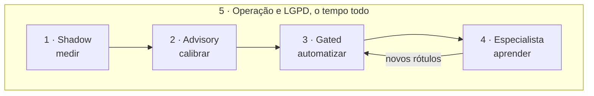
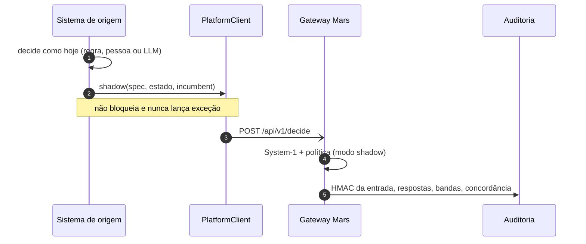
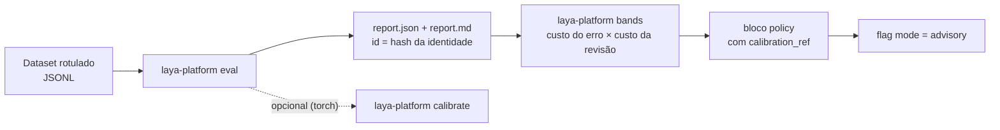
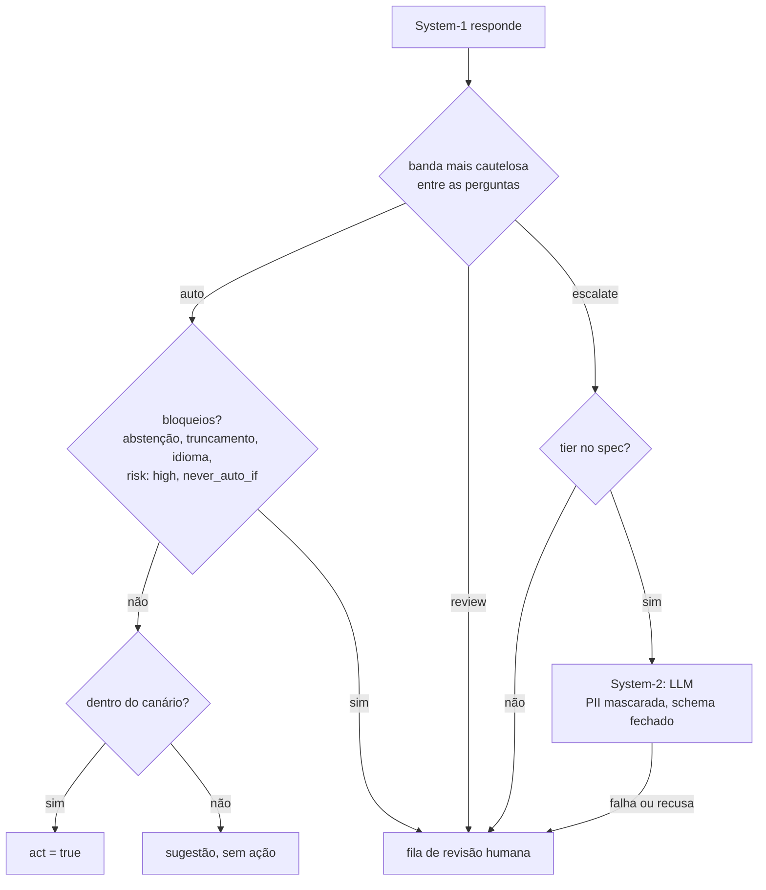
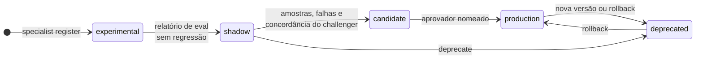

# Fluxos de trabalho

> **Público:** quem avalia, opera ou integra o Mars · **Status:** vigente (Blocos A, B e C) · **Atualizado:** 2026-10-03

Cinco fluxos ponta a ponta, na ordem em que normalmente acontecem. Cada um traz o objetivo, um diagrama, os
comandos, o que acompanhar e como desfazer. Os exemplos usam o spec sintético de
[`examples/support_triage`](../examples/support_triage/README.md). As imagens vêm de
[`scripts/make_demo_assets.py`](../scripts/make_demo_assets.py), com motor simulado e dados sintéticos.

> A CLI e o pacote ainda se chamam `laya-platform` e `laya_platform`. Dados reais só entram depois da aprovação do
> gate DG-1 ([DATA_GOVERNANCE.md](DATA_GOVERNANCE.md)).



| # | fluxo | começa com | termina com |
|---|---|---|---|
| 1 | [Ligar em shadow a um sistema existente](#1-ligar-em-shadow-a-um-sistema-existente) | um processo que já decide | concordância medida, sem risco |
| 2 | [Avaliar, calibrar e passar para advisory](#2-avaliar-calibrar-e-passar-para-advisory) | um dataset rotulado | bandas justificadas e sugestões para o operador |
| 3 | [Automatizar com segurança: gated, LLM e humano](#3-automatizar-com-segurança-gated-llm-e-humano) | uma política calibrada | automação no canário, o resto com LLM ou humano |
| 4 | [Treinar e promover um especialista](#4-treinar-e-promover-um-especialista) | rótulos acumulados | um modelo do seu domínio em produção, com rollback |
| 5 | [Operar no dia a dia e atender à LGPD](#5-operar-no-dia-a-dia-e-atender-à-lgpd) | o gateway no ar | saúde, custos, flags, expurgo e exclusão |

---

## 1. Ligar em shadow a um sistema existente

**Objetivo:** ver como o Mars decidiria os casos reais, lado a lado com o processo atual, sem mudar nada no
sistema de origem.

**Quando usar:** sempre primeiro. Nenhuma sugestão volta para o sistema e nenhuma ação é tomada.



**Passo a passo**

1. Escreva o `DecisionSpec`, com `mode: shadow` ([exemplo](../examples/support_triage/specs/support_triage.yaml),
   formato em [DEVELOPMENT.md §5.2](DEVELOPMENT.md#52-decisionspec)).
2. Suba o gateway:

   ```bash
   export LAYA_PLATFORM_HMAC_KEY="..."        # 32+ caracteres, fora do git
   uv run laya-platform serve --config gateway.yaml
   ```

3. No sistema de origem, envie cada caso junto com a decisão que ele já tomou (`incumbent`):

   ```python
   from laya_platform.client import PlatformClient

   mars = PlatformClient("http://localhost:8000", api_key=os.environ["MARS_API_KEY"])
   mars.shadow("examples.support_triage", ticket_text, incumbent={"department": equipe_atual})
   ```

   `shadow()` coloca a chamada numa fila limitada em segundo plano. Uma falha do gateway nunca afeta o sistema de
   origem; o cliente só conta `sent`, `failed` e `dropped`.

**O que acompanhar:** `laya_platform_incumbent_agreement_total` (concordância por pergunta),
`laya_platform_bands_total` e a latência em `laya_platform_decision_latency_seconds`.

**Como desfazer:** pare de chamar `shadow()`. Nada mais muda.

---

## 2. Avaliar, calibrar e passar para advisory

**Objetivo:** escolher limiares de confiança justificados pelo custo do erro e mostrar as sugestões a quem decide.



**Passo a passo**

1. Monte um dataset rotulado: uma linha JSON por caso, com `state`, `expected`, `language` e `tags`
   ([exemplo sintético](../examples/support_triage/eval_ptbr.jsonl)).
2. Avalie:

   ```bash
   uv run laya-platform eval --spec specs/support_triage.yaml --data eval.jsonl --out reports/triage
   ```

   O relatório traz, por pergunta, classe e fatia: acurácia, P/R/F1, ECE, Brier, NLL, cobertura × risco, abstenção
   e latência. Tudo sobre `answer_confidence`, nunca sobre a confiança por entropia.
3. Escolha as bandas pelo custo:

   ```bash
   uv run laya-platform bands --report reports/triage/report.json --error-cost 5 --review-cost 1
   ```

   O comando imprime o bloco `policy` pronto para colar no spec, com o `calibration_ref` do relatório de origem.
4. Opcional, com torch e pesos: ajuste as temperaturas com o próprio upstream.

   ```bash
   uv run laya-platform calibrate --spec specs/support_triage.yaml --data cal.jsonl \
     --model multilingual --out calibration/triage.json
   ```

5. Passe o spec para advisory sem reiniciar (escopo `admin`):

   ```bash
   curl -X PUT localhost:8000/api/v1/flags/mode:examples.support_triage \
     -H "Authorization: Bearer $ADMIN_KEY" -d '{"value": "advisory"}'
   ```

**O que acompanhar:** a distribuição das bandas (`laya_platform_bands_total`) e o histograma de
`laya_platform_answer_confidence`. Se ele mudar muito em relação ao relatório, é hora de reavaliar.

**Como desfazer:** a mesma flag com `"shadow"`, ou `"value": null` para voltar ao modo do spec.

---

## 3. Automatizar com segurança: gated, LLM e humano

**Objetivo:** deixar o Mars agir sozinho só onde a política calibrada permite. O resto vai para um LLM ou para uma
pessoa, sempre com o motivo registrado.



**Passo a passo**

1. No spec, ligue o modo `gated` com a política do fluxo 2:

   ```yaml
   mode: gated
   risk: medium
   policy:
     calibration_ref: eval-3f2a9c1b0d4e
     bands: [{min: 0.92, outcome: auto}, {min: 0.7, outcome: review}, {outcome: escalate}]
     never_auto_if: [{question: churn_risk, equals: true}]
     escalation_tier: deep        # sem tier, escalate vai para um humano
     canary: 0.05                 # 5% do tráfego pode agir
   ```

2. Opcional: configure o System-2 no `gateway.yaml` (bloco `llm`, [DEVELOPMENT.md §5.5](DEVELOPMENT.md#55-llm-gateway-e-system-1system-2-bloco-b-f5f6)).
   Provedores externos exigem `allow_external: true` e, com dados reais, o DG-1 aprovado. Um tier local (Ollama
   ou vLLM) não tira dados da empresa.
3. Integre a fila de revisão ao sistema de origem. Ele mostra o caso ao revisor, porque o Mars não guarda a entrada,
   e devolve a resolução:

   ```bash
   curl localhost:8000/api/v1/reviews -H "Authorization: Bearer $REVIEW_KEY"
   curl -X POST localhost:8000/api/v1/reviews/42/resolve -H "Authorization: Bearer $REVIEW_KEY" \
     -d '{"values": {"department": "account", "urgency": 3, "churn_risk": true}}'
   ```

4. Aumente o `canary` aos poucos, conforme o erro automatizado medido. Hoje o spec é lido na inicialização, então
   a mudança exige reiniciar o gateway.

**Exemplos:** [decisão automatizada](assets/demo/decide-auto.svg) · [revisão humana](assets/demo/review.svg) ·
[escalonamento para LLM](assets/demo/system2.svg).

**O que acompanhar:** `laya_platform_policy_outcomes_total`, `laya_platform_acts_total`,
`laya_platform_llm_cost_total`, `laya_platform_system2_agreement_total` (quando é alta, aquele LLM pode deixar de
ser chamado) e `laya_platform_reviews_open` / `laya_platform_reviews_oldest_age_seconds`.

**Como desfazer:** o kill switch devolve todos os specs a `shadow` na hora:

```bash
curl -X PUT localhost:8000/api/v1/flags/kill_switch -H "Authorization: Bearer $ADMIN_KEY" -d '{"value": true}'
```

---

## 4. Treinar e promover um especialista

**Objetivo:** transformar os rótulos acumulados num modelo do seu domínio e colocá-lo em produção só se ele for
comprovadamente melhor, com volta garantida.

**Pré-requisitos:** DG-1 aprovado (dados reais), uma GPU (uma T4 do Kaggle ou do Colab serve) e acesso ao Hugging
Face para o checkpoint base.



**Passo a passo**

1. **Dados:**

   ```bash
   uv run laya-platform dataset candidates --db-url $DB --spec-id examples.support_triage   # o que rotular
   # o sistema de origem exporta {"trace_id", "state", "group", "language"} em JSONL
   uv run laya-platform dataset build --db-url $DB --spec S.yaml --inputs export.jsonl --out labelled.jsonl
   uv run laya-platform dataset split --spec S.yaml --data labelled.jsonl --out splits/ --by group
   ```

   O `build` só aceita uma linha cujo HMAC bate com o da decisão auditada, mascara PII e marca a origem do rótulo
   (`human` > `incumbent` > `teacher`). Opcional: `dataset label` usa um LLM como professor, com votos.
2. **Treino**, pela receita do próprio upstream (fixada por commit e sha256):

   ```bash
   uv run laya-platform train --spec S.yaml --data splits/train.jsonl --dataset-manifest splits/manifest.json \
     --base multilingual --base-dir models/base-multilingual --upstream-dir upstream/ --fetch-upstream \
     --out models/triage_pt-1 --name support.triage_pt --version 1 --owner "Márcio"
   ```

3. **Comparação** com o Router no mesmo dataset:

   ```bash
   uv run laya-platform eval --spec S.yaml --data splits/test.jsonl \
     --specialist models/triage_pt-1/specialist.yaml --out reports/triage_pt-1
   ```

4. **Ciclo de vida:**

   ```bash
   uv run laya-platform specialist register --db-url $DB --manifest models/triage_pt-1/specialist.yaml --actor ml
   uv run laya-platform specialist shadow --db-url $DB --name support.triage_pt --version 1 --spec S.yaml \
     --report reports/triage_pt-1/report.json --baseline reports/router/report.json --actor ml
   # o gateway roda o especialista como challenger, depois de responder, e registra a concordância
   uv run laya-platform specialist candidate --db-url $DB --name support.triage_pt --version 1 --actor ml
   uv run laya-platform specialist promote --db-url $DB --name support.triage_pt --version 1 \
     --actor "Márcio" --reason "aprovado na revisão"
   ```

**Exemplo:** [promoção e rollback](assets/demo/specialists.svg).

**O que acompanhar:** `laya_platform_challenger_agreement_total`, `laya_platform_challenger_errors_total`,
`laya_platform_served_by_total` e `specialist_errors` em `/ready`.

**Como desfazer:** sem deploy, pela CLI ou pela API (escopo `admin`):

```bash
uv run laya-platform specialist rollback --db-url $DB --spec-id examples.support_triage \
  --actor plantão --reason "regressão em produção"
curl -X POST localhost:8000/api/v1/specialists/rollback -H "Authorization: Bearer $ADMIN_KEY" \
  -d '{"spec": "examples.support_triage", "reason": "regressão em produção"}'
```

Um especialista que falha ao carregar nunca bloqueia uma decisão: o Router responde e o erro aparece em `/ready`.

---

## 5. Operar no dia a dia e atender à LGPD

**Objetivo:** manter o gateway saudável, os custos sob controle e os pedidos dos titulares atendidos.

| tarefa | como |
|---|---|
| Saúde | `GET /ready`: banco, specs carregados, engine, tiers de LLM e erros de carga de especialistas (503 sem banco ou sem spec) |
| Métricas | `GET /metrics` (escopo `metrics`), no formato Prometheus, com o prefixo `laya_platform_` ([exemplo](assets/demo/metrics.svg)) |
| Modo por spec | `PUT /api/v1/flags/mode:<spec>` com `shadow`, `advisory` ou `gated` |
| Emergência | `PUT /api/v1/flags/kill_switch` com `true`: tudo volta a `shadow` |
| Quem mudou o quê | `GET /api/v1/flags/events` e `specialist list`; cada mudança registra o autor |
| Custo de LLM | `llm.daily_budget` no `gateway.yaml`, somado no banco para todos os processos; métrica `laya_platform_llm_cost_total` |
| Retenção | `laya-platform db purge --url $DB --older-than-days 180` (não toca revisões abertas nem as trilhas de operação) |
| Exclusão do titular | o sistema de origem calcula o HMAC das entradas do titular; `laya-platform db forget --url $DB --hmac <hmac>` ou `--hmac-file` |

O HMAC é o mesmo que o gateway grava, com a mesma chave (`LAYA_PLATFORM_HMAC_KEY`):

```python
from laya_platform.privacy import input_hmac

hmac_da_entrada = input_hmac(os.environ["LAYA_PLATFORM_HMAC_KEY"].encode("utf-8"), estado)
```

**Antes de dados reais:** decidir os itens pendentes e aprovar o [DG-1](DATA_GOVERNANCE.md). Só então configure
`data_classification: real` e `dg1_approval_ref` no gateway.
